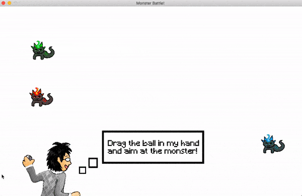

# MonsterBattleGame
A monster battle game I made in Java back in 2018. Uploading it now.


To compile,
```
javac MonsterBattle.java
```

To execute,
```
java MonsterBattle
```

To play, drag the ball in the player's hand and aim it towards one of the monsters.
Once you catch the monsters, an enemy will appear. 
Here, you can control your monster's left and right movements using your mouse, and shoot projectiles using mouse clicks.
You will also need to avoid the enemy's projectiles. 

The game proceeds to the next level once the enemy's health is drained. 
The game ends once your monster's health is gone.


All sprites and game assets were made by me using Procreate.

A short demo can be seen below.


 

The full demo can be seen in [my Youtube Video](https://youtu.be/b9doC8p-Cvk).
